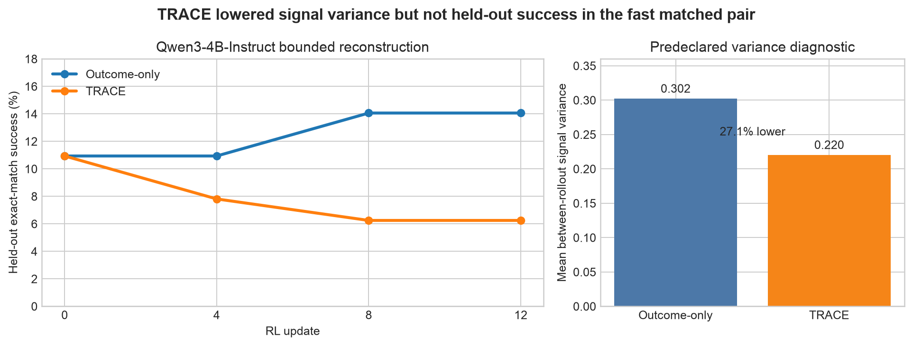

# TRACE turn-level credit: bounded claim reproduction



**Assessment: partially reproduced.** On a public, closed-web BrowseComp-Plus
slice, TRACE reduced the predeclared between-rollout learning-signal variance by
27.1%, matching the proposed mechanism's direction. Under the same bounded
schedule, however, it did not improve held-out success or produce earlier gains:
the fast matched pair finished at 6.25% TRACE versus 14.06% outcome-only. This is
a test of the downscaled reconstruction described below, not a verdict on the
paper's full-scale result.

[](https://molab.marimo.io/github/alphaXiv/trace-turn-level-reward-assignment-via-credit-es/blob/main/notebooks/trace_reproduction.py)

The [interactive notebook](https://molab.marimo.io/github/alphaXiv/trace-turn-level-reward-assignment-via-credit-es/blob/main/notebooks/trace_reproduction.py)
opens this evidence without rerunning the expensive experiment.

## Central question

Long tool-use trajectories normally receive a single terminal success signal.
That makes it difficult to tell which search or browsing action helped. TRACE
proposes a critic-free dense signal: ask a frozen reference language model how
probable the gold answer is at each tool-call boundary, then reward transitions
that make the answer easier to predict.

The controlled Qwen3-4B result in the [paper](https://arxiv.org/abs/2607.13988)
reports 35.6% BrowseComp-Plus success for TRACE and 30.0% for matched GRPO, a
+5.6 percentage-point advantage. Its training curves also show earlier gains.
The paper motivates lower-variance credit assignment but does not report the
between-rollout variance statistic used here; that diagnostic is an explicit
addition to this reproduction.

## Implementation

The experiment uses the public `Qwen/Qwen3-4B-Thinking-2507` checkpoint for the
exact-model pair. A faster `Qwen/Qwen3-4B-Instruct-2507` pair was run first to
debug the reconstructed agent and obtain a fully matched result within the
deadline. Both use the native Qwen chat template with `search`, `open`, and
`find` function schemas.

For a frozen reference model and gold answer \(y^*\), the implementation computes
mean answer-token log probability at tool boundary \(s_t\):

\[
\ell_t=|y^*|^{-1}\log p_{\mathrm{ref}}(y^*\mid s_t),\quad
g_t=-\ell_t+\epsilon,\quad
\delta_t=\log\frac{g_t}{g_{t+1}}.
\]

It then averages the next \(K=3\) deltas with normalized discount
\(\gamma=0.8\). The LoRA adapter is disabled while calculating these scores,
which keeps the reference model fixed. At trajectory end, the code adds the
paper's scaled group-relative outcome fill. TRACE and outcome-only differ only
in whether this dense term is added to the same group-relative policy-gradient
update.

The consequential code path is compact:

```python
scores = [answer_score(reference, prefix, gold) for prefix in boundaries]
gaps = [-score + epsilon for score in scores]
deltas = [log(gaps[t] / gaps[t + 1]) for t in range(len(gaps) - 1)]
credit_t = discounted_normalized_average(deltas[t:t + K], gamma=0.8)
advantage = outcome_advantage + 0.2 * credit_t
```

Each Kubernetes job launches eight independent one-GPU replicas. Rank zero
creates a deterministic split, and replicas use seeds 260713988 through
260713995. A terminal JSON block includes every per-replica curve, the aggregate
curve, the exact held-out query IDs, configuration, elapsed time, GPU model, and
the predeclared variance metric.

## Data and protocol

We use one official encrypted
[BrowseComp-Plus](https://huggingface.co/datasets/Tevatron/browsecomp-plus)
parquet shard and the release's public decryption canary. Eligible questions
have nonempty released gold documents and gold answers of at most eight
whitespace tokens. Sorting by SHA-256 of `query_id` selects 16 training and 8
disjoint held-out questions. Every question's offline browser contains all its
released gold documents and up to 32 released hard negatives; document text is
capped at 12,000 characters. Evaluation is normalized exact match.

| Dimension | Paper setup | This reproduction |
|---|---:|---:|
| Base model | Qwen3-4B-Thinking-2507 | Exact pair plus Instruct scout |
| RL updates | 200 | 12 |
| Maximum tool turns | 60 | 4 |
| Rollouts per prompt | 8 | 4 |
| Training / held-out questions | Full reported environment | 16 / 8 deterministic slice |
| Search corpus | Full closed-web index | Query-local released gold + ≤32 hard negatives |
| Policy update | GRPO | Group-relative REINFORCE with LoRA |
| Replication | Paper reports single runs | 8 independent GPU replicas per method |

These substitutions make the test feasible under the fixed compute deadline,
but they also lower power and change the exploration problem materially. The
query-local corpus is public and closed during rollout, yet easier and smaller
than the paper's full index. Conversely, exact match on only eight held-out
questions is coarse: one success per replica moves that replica by 12.5 points.

## Observed evidence

### Fast matched pair

The Instruct scout pair shares its checkpoint, data, seeds, rollout budget,
optimizer, evaluator, and schedule. Across 8 replicas × 8 held-out questions
(64 sampled evaluations per checkpoint), the outcome-only control improved from
10.94% to 14.06%. TRACE declined to 6.25%.

| Update | Outcome-only success | TRACE success | TRACE − control |
|---:|---:|---:|---:|
| 0 | 10.94% | 10.94% | 0.00 pp |
| 4 | 10.94% | 7.81% | −3.13 pp |
| 8 | 14.06% | 6.25% | −7.81 pp |
| 12 | 14.06% | 6.25% | −7.81 pp |

The predeclared variance statistic is the mean, across updates, of the population
variance within each four-rollout group of each rollout's mean token advantage.
It was 0.3021 for outcome-only and 0.2202 for TRACE: a 27.1% reduction. This
supports the variance direction, but the lower variance did not translate to
better held-out success in this run.

### Exact paper-checkpoint pair

The exact `Qwen/Qwen3-4B-Thinking-2507` matched pair was launched concurrently
on the same protocol. Its terminal measurements are incorporated into the final
assessment and notebook after both jobs finish.

## Claim-by-claim assessment

| Claim | Paper evidence | Observed evidence | Assessment |
|---|---|---|---|
| TRACE improves held-out closed-web search over outcome-only RL | 35.6% vs 30.0% on controlled Qwen3-4B (+5.6 pp) | Fast pair: 6.25% vs 14.06% (−7.81 pp) | **Inconclusive under this setup.** This run did not show the reported effect. |
| TRACE produces earlier success gains | Paper training curve rises earlier | At updates 4 and 8, TRACE was 3.13 and 7.81 pp below the control | **Not aligned in the bounded fast pair.** |
| TRACE lowers between-rollout reward variance | Mechanistic motivation; no directly comparable paper number | 0.2202 vs 0.3021, 27.1% lower | **Aligned in direction under the predeclared diagnostic.** |

The mixed result warrants **partially reproduced**, rather than a broad negative
conclusion. The variance mechanism appeared in a clean matched comparison, while
the task-level benefit did not appear at this scale. Plausible explanations are
the 12-update horizon, four-turn cap, small split, query-local retrieval corpus,
and simplified group-relative update. TRACE's dense term may also require more
rollout diversity or a longer schedule before its lower variance becomes useful.

## Compute and provenance

Every formal measurement ran through OpenResearch Kubernetes on **NVIDIA RTX PRO
6000 Blackwell** GPUs. Jobs used 8 GPUs each and the campaign reached **16 GPUs
concurrently**. The exact entrypoint on every experiment branch was `bash run.sh`.
Actual campaign wall time is recorded in `autoresearch.json` after the final
terminal run.

Important branches:

- [Qwen3-4B-Instruct tool-agent baseline](https://github.com/alphaXiv/trace-turn-level-reward-assignment-via-credit-es/tree/orx/qwen3-4b-instruct-tool-agent)
- [Outcome-only RL](https://github.com/alphaXiv/trace-turn-level-reward-assignment-via-credit-es/tree/orx/outcome-only-rl)
- [TRACE RL](https://github.com/alphaXiv/trace-turn-level-reward-assignment-via-credit-es/tree/orx/trace-rl)
- [Exact Qwen3-4B-Thinking baseline](https://github.com/alphaXiv/trace-turn-level-reward-assignment-via-credit-es/tree/orx/paper-length-thinking-baseline)
- [Exact-checkpoint outcome-only RL](https://github.com/alphaXiv/trace-turn-level-reward-assignment-via-credit-es/tree/orx/thinking-outcome-only-rl)
- [Exact-checkpoint TRACE RL](https://github.com/alphaXiv/trace-turn-level-reward-assignment-via-credit-es/tree/orx/thinking-trace-rl)

## What a full-scale reproduction still needs

A decisive reproduction would restore the full BrowseComp-Plus closed-web index,
60-turn trajectories, 8 rollouts per prompt, the paper's 200-update clipped GRPO
trainer, and multiple full-scale seeds. It should preserve the paired variance
instrumentation introduced here, report confidence intervals over held-out
questions and training seeds, and ablate the TRACE auxiliary weight and terminal
fill separately.

